<div align="center">

# 🎬 ffgo

### FFmpeg for humans.

**Stop copy-pasting FFmpeg incantations from Stack Overflow.**
`ffgo` gives you simple, memorable commands for everything you actually do with video —
and shows you the exact FFmpeg it runs, every time.

[](https://github.com/arbazkhan971/ffgo/actions/workflows/ci.yml)
[](https://github.com/arbazkhan971/ffgo/releases)
[](https://pkg.go.dev/github.com/arbazkhan971/ffgo)
[](https://goreportcard.com/report/github.com/arbazkhan971/ffgo)
[](LICENSE)



</div>

---

## The problem

FFmpeg is the most powerful media tool on earth. It's also famously impossible to remember.
Want a 25 MB clip for Discord? Here's the "simple" way:

```sh
# The FFmpeg way 😵
ffmpeg -i input.mp4 -c:v libx264 -b:v 2600k -pass 1 -an -f null /dev/null && \
ffmpeg -i input.mp4 -c:v libx264 -b:v 2600k -pass 2 -c:a aac -b:a 128k out.mp4
# ...where did 2600k come from? You did the bitrate math by hand.
```

```sh
# The ffgo way 😌
ffgo compress input.mp4 --target 25mb
```

`ffgo` does the math, picks sane defaults, shows a real progress bar, and prints the exact
FFmpeg command it used so you always know what happened.

## Before / after

| You want to…                     | Raw FFmpeg                                                                              | ffgo                                             |
| -------------------------------- | -------------------------------------------------------------------------------------- | ------------------------------------------------ |
| See what's in a file             | `ffprobe -v error -show_format -show_streams -of json in.mp4` + read JSON               | `ffgo inspect in.mp4`                            |
| Hit a target size                | two-pass encode + manual bitrate math                                                   | `ffgo compress in.mp4 --target 25mb`             |
| Make a clean GIF                 | `palettegen` → `paletteuse` filter graph                                                | `ffgo gif in.mp4 --from 10s --to 20s`            |
| Trim losslessly                  | `-ss … -to … -c copy` (and remember `-ss` goes *before* `-i`)                           | `ffgo trim in.mp4 --from 0:10 --to 0:30`         |
| Convert but keep quality         | figure out if you can stream-copy or must re-encode                                     | `ffgo convert in.mov --to mp4`                   |
| Normalize loudness               | `-af loudnorm=I=-16:TP=-1.5:LRA=11`                                                     | `ffgo audio normalize in.mp4`                    |
| Understand a command you found   | 🤷 open six man pages                                                                   | `ffgo explain "ffmpeg -i …"`                     |

## Install

<details open>
<summary><b>Homebrew (macOS)</b></summary>

```sh
brew install arbazkhan971/tap/ffgo
```
</details>

<details>
<summary><b>Scoop (Windows)</b></summary>

```powershell
scoop bucket add arbazkhan971 https://github.com/arbazkhan971/scoop-bucket
scoop install ffgo
```
</details>

<details>
<summary><b>Go</b></summary>

```sh
go install github.com/arbazkhan971/ffgo@latest
```
</details>

<details>
<summary><b>Docker (FFmpeg included)</b></summary>

```sh
docker run --rm -v "$PWD:/work" ghcr.io/arbazkhan971/ffgo inspect video.mp4
```
</details>

<details>
<summary><b>Prebuilt binaries</b></summary>

Grab a single binary for your platform from the [releases page](https://github.com/arbazkhan971/ffgo/releases).
No runtime, no dependencies — just drop it on your `PATH`.
</details>

<details>
<summary><b>Linux packages (deb / rpm / apk)</b></summary>

Download the package for your distro and arch from the
[latest release](https://github.com/arbazkhan971/ffgo/releases/latest):

```sh
sudo dpkg -i ffgo_*_linux_amd64.deb    # Debian / Ubuntu
sudo rpm -i  ffgo_*_linux_amd64.rpm    # Fedora / RHEL
sudo apk add --allow-untrusted ffgo_*_linux_amd64.apk   # Alpine
```
</details>

> **Requirement:** `ffgo` drives FFmpeg, so you need `ffmpeg` and `ffprobe` installed
> ([download](https://ffmpeg.org/download.html)). The Homebrew and Docker installs pull it in for you.

## Quick start

```console
$ ffgo inspect vacation.mp4

🎬  vacation.mp4
  format    QuickTime / MOV
  duration  2:14
  size      212 MB
  bitrate   13.2 Mbps

📹 Video
  codec      h264 (High)
  resolution 3840x2160  16:9
  fps        59.94
  bitrate    12.8 Mbps

🔊 Audio
  codec     aac
  channels  stereo
  bitrate   256 kbps

💡 Recommendations
  → Large file (212 MB) — shrink it with ffgo compress vacation.mp4 --target 25mb
  → High frame rate (60 fps) — halve it if you need smaller output
```

## What it can do

Every command supports `--dry-run` (print the FFmpeg, run nothing) and `--show-command`
(print it, then run it). Nothing is a black box.

### 🔍 `inspect` — understand any file
```sh
ffgo inspect movie.mkv          # readable summary + recommendations
ffgo inspect clip.mp4 --json    # full ffprobe JSON, pipe to jq
```

### 🔄 `convert` — change container, keep quality
```sh
ffgo convert clip.mov --to mp4  # stream-copies when it can (instant, lossless)
ffgo convert in.mkv -o out.webm # re-encodes only when it must
```

### 🗜️ `compress` — three ways to shrink
```sh
ffgo compress big.mp4 --target 25mb      # hit an exact size
ffgo compress big.mp4 --quality high     # low | medium | high
ffgo compress big.mp4 --preset whatsapp  # platform-tuned
```
Presets: `whatsapp` · `youtube` · `discord` · `telegram` · `twitter` · `web` · `email`.

### ✂️ `trim` — cut a clip
```sh
ffgo trim in.mp4 --from 00:01:20 --to 00:03:00   # lossless (keyframe-fast)
ffgo trim in.mp4 --from 10s --duration 30s --reencode   # frame-accurate
```

### 🎞️ `gif` — high-quality GIFs
```sh
ffgo gif in.mp4 --from 10s --to 20s --width 480 --fps 15
```

### 🔊 `audio`
```sh
ffgo audio extract song.mkv --format mp3
ffgo audio normalize podcast.wav      # EBU R128 loudness
ffgo audio silence-remove voice.mp3
ffgo audio convert track.wav --to flac
```

### 💬 `subtitles`
```sh
ffgo subtitles burn movie.mp4 --sub subs.srt   # hardcode into the video
ffgo subtitles extract movie.mkv --format srt
ffgo subtitles convert subs.srt --to vtt
```

### 📦 `batch` — do it to everything
```sh
ffgo batch "./videos/*.mov" --to mp4
ffgo batch "./clips/*" --compress --target 50mb -o ./out
```

### 📖 `explain` — plain English for any FFmpeg command
```console
$ ffgo explain "ffmpeg -i in.mp4 -vf scale=1280:-1 -crf 23 -movflags +faststart out.mp4"

  -i in.mp4              input file: in.mp4
  -vf scale=1280:-1      video filter graph applying scale (resize the picture)
  -crf 23                quality target on a 0-51 scale where lower is better
  -movflags +faststart   move the MP4 index to the front so it streams while downloading
  out.mp4                output file: out.mp4
```

### 🤖 `ai` — describe it, don't script it
```sh
export FFGO_AI_PROVIDER=openai
export OPENAI_API_KEY=sk-...

ffgo ai "make this suitable for WhatsApp" clip.mov
ffgo ai "remove the silence and export mp3" interview.wav
ffgo ai            # interactive mode
```
The model proposes an FFmpeg command; `ffgo` shows it, explains it, warns you if it's risky,
and only runs it after you confirm. Works with **OpenAI, Anthropic, Gemini, Ollama, OpenRouter**,
or any OpenAI-compatible endpoint (`FFGO_AI_BASE_URL`).

## Why you'll like it

- **Transparent by default** — `--dry-run` shows the exact FFmpeg; nothing hidden.
- **Excellent defaults** — sensible codecs, pixel formats and `+faststart` so files just play.
- **Real feedback** — live progress bars with ETA, colorized output, human sizes and durations.
- **Helpful errors** — missing FFmpeg? It tells you how to install it for *your* OS.
- **One binary** — Linux, macOS, Windows. No runtime, tiny footprint, instant startup.

## Benchmarks

`ffgo` is a thin, native Go layer over FFmpeg — it adds no measurable overhead to an encode.

| Metric                       | Value            |
| ---------------------------- | ---------------- |
| Cold startup (`ffgo version`)| **< 10 ms**      |
| Binary size (stripped)       | ~7 MB, static    |
| Runtime dependencies         | just FFmpeg      |
| Encode overhead vs raw ffmpeg| none (same args) |

```sh
make bench   # run the Go benchmarks yourself
```

## Roadmap

- [ ] Concatenate / merge clips (`ffgo concat`)
- [ ] Watermark & overlay (`ffgo watermark`)
- [ ] Speed up / slow down (`ffgo speed`)
- [ ] Thumbnail & contact-sheet generation
- [ ] Shell completions in every package
- [ ] Two-pass mode for the tightest size targets

Have an idea? [Open an issue](https://github.com/arbazkhan971/ffgo/issues) — this list is community-driven.

## Contributing

PRs are very welcome — see [CONTRIBUTING.md](CONTRIBUTING.md). The codebase is small,
idiomatic Go with a clean split between the CLI (`cmd/`) and the engine (`internal/`).

```sh
git clone https://github.com/arbazkhan971/ffgo && cd ffgo
make build && ./ffgo inspect testdata/sample.mp4
make check   # fmt + vet + test
```

## FAQ

<details>
<summary><b>Does ffgo bundle FFmpeg?</b></summary>

No — it calls the `ffmpeg`/`ffprobe` already on your system, so you get your platform's
hardware acceleration and codec support. The Docker image and Homebrew formula install it for you.
</details>

<details>
<summary><b>Is it just a wrapper?</b></summary>

It's a *better interface*. `ffgo` does the bitrate math, palette generation, copy-vs-reencode
decisions and loudness targets for you, then shows the resulting command so you learn and stay
in control. You can copy any `--dry-run` output straight into a script.
</details>

<details>
<summary><b>Will it re-encode when it doesn't need to?</b></summary>

No. `convert` stream-copies compatible streams (instant, lossless) and only re-encodes when the
target container requires it. `trim` is lossless by default.
</details>

<details>
<summary><b>Do I need an API key for AI mode?</b></summary>

Only for the `ai` command, and only for the provider you choose. Everything else is 100% local.
You can also run `ai` fully offline with [Ollama](https://ollama.com).
</details>

## License

[MIT](LICENSE) © Arbaz Khan.

Built with ❤️ for everyone who has ever googled "ffmpeg how to…".
If `ffgo` saved you a trip to Stack Overflow, consider giving it a ⭐.
